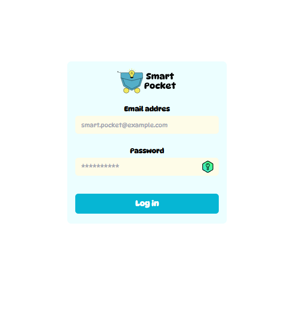
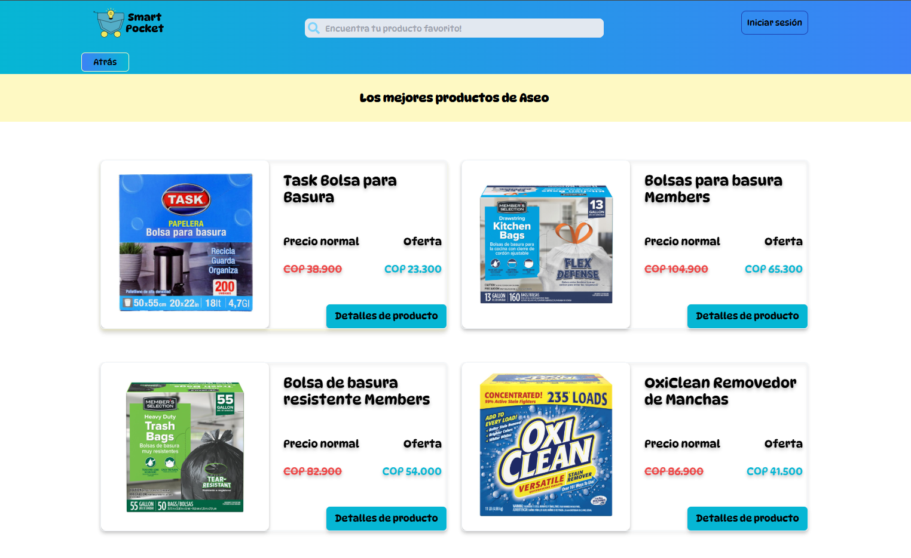
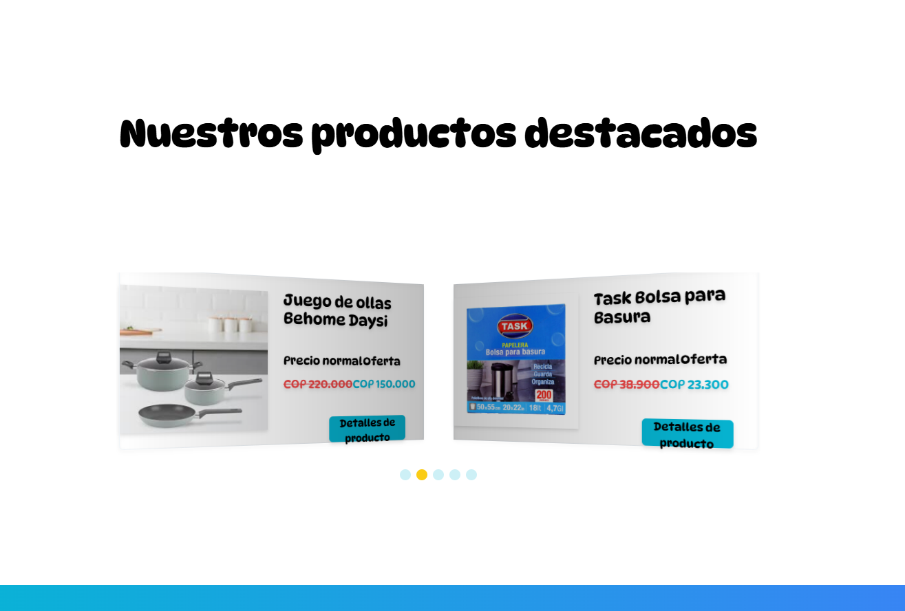
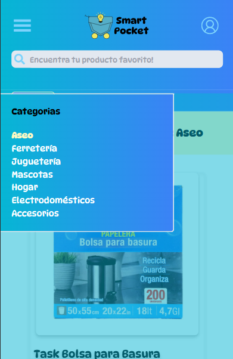

# Smart Pocket v1 (Frontend)


Smart Pocket es una aplicación web para venta de productos nuevos y saldos mediante tarjetas de presentación de productos y consultas vía whatsapp al propietario. Este repositorio contiene el código fuente del frontend, desarrollado con React.

## 🚀 Demo en Vivo

Puedes explorar la aplicación desplegada en modo público:

- **Frontend Demo**: [https://smart-pocket-v1.vercel.app/](https://smart-pocket-v1.vercel.app/)

**Funcionalidades públicas disponibles:**

- ✅ Explorar catálogo de productos
- ✅ Ver detalles de productos
- ✅ Filtrar por categorías
- ✅ Búsqueda de productos
- ✅ Contacto vía WhatsApp

> **Nota:** El panel de administración está en uso por un cliente real y no está disponible para pruebas públicas. Para probar las funcionalidades completas del CRUD, sigue las instrucciones de instalación local más abajo.

## 📸 Vista Previa

### 🔒 Inicio de sesión


_Formulario para ingreso al panel de administración_

### 📦 Vista por categoría


_Vista de productos por categoría específica_

### 🎠 Carrusel de productos


_Carrusel para mostrar productos destacados_

### 📱 Menú responsive


_Menú de la aplicación en vista mobile_

## ✨ Características

- **Gestión administrativa:** Permite al propietario gestionar (registrar, modificar, eliminar y consultar) los productos en su inventario.

- **Visualización:** Ofrece tarjetas y tablas de productos con información sencilla y clara.

- **Carrusel:** Utiliza un carrusel dinámico (Swiper) para destacar productos en la página principal.

- **Interfaz Intuitiva:** Diseño responsivo y fácil de usar.

## 🛠️ Tecnologías Utilizadas

- **React:** Biblioteca principal para la construcción de la UI.
- **Tailwind CSS:** Framework de CSS para estilos.
- **Axios:** Cliente HTTP para la comunicación con el backend.
- **React Router:** Manejo de rutas dentro de la aplicación.
- **React Hook Form:** Manejo de formularios.
- **Swiper:** Carrusel de tarjetas de productos destacados.
- **React Icons:** Iconografía de la app

## 🏗️ Arquitectura

```sh
Smart_Pocket_Frontend/
│
├── public/                    # Archivos estáticos (favicon, manifest)
│   ├── index.html
│   ├── favicon.ico
│   └── manifest.json
│
├── src/                       # Código fuente principal
│   ├── components/            # Componentes reutilizables
│   │   ├── Aside.jsx
│   │   ├── Card.jsx
│   │   ├── Categories.jsx
│   │   ├── CreateForm.jsx
│   │   ├── Error.jsx
│   │   ├── Footer.jsx
│   │   ├── FooterImage.jsx
│   │   ├── Header.jsx
│   │   ├── Jumbo.jsx
│   │   ├── Loading.jsx
│   │   ├── LoadingImage.jsx
│   │   ├── Main.jsx
│   │   ├── MobileMenu.jsx
│   │   ├── Nav.jsx
│   │   ├── ProductCard.jsx
│   │   ├── ProductCarousel.jsx
│   │   ├── ProductNotFound.jsx
│   │   ├── Public.jsx
│   │   ├── SmartForm.jsx
│   │   ├── SmartIcon.jsx
│   │   ├── SmartLogo.jsx
│   │   ├── Success.jsx
│   │   └── UpdateForm.jsx
│   │
│   ├── pages/                 # Páginas/Vistas principales
│   │   ├── HomePage.js
│   │   ├── LoginPage.js
│   │   ├── AdminPage.js
│   │   ├── Dashboard.js
│   │   ├── DetailPage.js
│   │   ├── CategoryPage.js
│   │   ├── ProductDetailPage.js
│   │   ├── CreateProducts.js
│   │   ├── UpdateProductsPage.js
│   │   ├── DeleteProductsPage.js
│   │   ├── SearchResults.js
│   │   └── ErrorPage.js
│   │
│   ├── context/               # Context API
│   │   └── AuthContext.jsx    # Gestión de autenticación
│   │
│   ├── hooks/                 # Custom hooks
│   │   ├── useFetch.js        # Hook para llamadas HTTP
│   │   └── useQueryForWp.js   # Hook para queries
│   │
│   ├── layouts/               # Layouts reutilizables
│   │   └── MainLayout.jsx
│   │
│   ├── utils/                 # Funciones auxiliares
│   │   ├── formattedAmount.js
│   │   └── handleUpload.js
│   │
│   │
│   ├── assets/                # Imágenes y recursos estáticos
│   │   ├── logos/
│   │   ├── icons/
│   │   └── images/
│   │
│   ├── App.js                 # Componente raíz
│   ├── index.js               # Punto de entrada
│   └── index.css              # Estilos globales
│
├── .env.example               # Variables de entorno
├── .gitignore
├── package.json               # Dependencias
├── package-lock.json
└── tailwind.config.js         # Configuración Tailwind CSS
```

### 📊 **Estructura de Carpetas**

| Carpeta         | Responsabilidad                                            |
| --------------- | ---------------------------------------------------------- |
| **components/** | Componentes reutilizables (botones, tarjetas, formularios) |
| **pages/**      | Vistas completas de cada ruta de la aplicación             |
| **context/**    | Context API para estado global (autenticación)             |
| **hooks/**      | Custom hooks para lógica reutilizable                      |
| **layouts/**    | Layouts comunes para múltiples páginas                     |
| **utils/**      | Funciones auxiliares y helpers                             |
| **assets/**     | Imágenes, iconos y recursos estáticos                      |

## 📋 Requisitos Previos

- **Node.js:** Se recomienda tener instalada la versión 20.
- **npm:** Generalmente incluido con Node.js.

## ⚙️ Instalación y Configuración

1. Clonar el repositorio:

```sh
git clone https://github.com/Mauricio2085/smart-pocket-v1.git
cd smart-pocket-v1
```

2. Configuración de variables de entorno:

Crea los archivos .env.development y .env.production asegurándose que esté en la raíz del proyecto y añade las siguientes variables:

```sh
# Para .env.development
REACT_APP_API_URL=http://localhost:5000/api/v1

# Para .env.production
REACT_APP_API_URL=https://tu_backend_de_despliegue/api/v1
```

Ajusta REACT_APP_API_URL según la URL de tu backend.

**Nota:** El archivo `.env.example` ya contiene la configuración necesaria. Solo cópialo y ajusta los valores.

3. Instalar y ejecutar:

```sh
npm install
npm start
```

## Scripts Disponibles

En el directorio del proyecto, puedes ejecutar:

- **npm start** - Inicia la aplicación en modo desarrollo en http://localhost:3000

- **npm run build** - Construye la aplicación para producción en la carpeta build

- **npm test** - Ejecuta tests (si están disponibles)

## 🔑 Seguridad

- Manejo de rutas privadas con autenticación JWT
- Tokens de corta duración para sesiones seguras
- Variables de entorno para credenciales sensibles
- Protección contra CSRF en formularios
- Validación de inputs en cliente

## 📑 Secciones de la Aplicación

### Vistas Privadas (Requieren autenticación JWT)

- **Login:** Autenticación segura del propietario
- **Dashboard:** Resumen del inventario con opciones de CRUD
- **Gestión de Productos:** Crear, editar y eliminar productos

### Vistas Públicas (Acceso libre)

- **Home:** Página de inicio con carrusel de productos destacados
- **Catálogo:** Explorar productos por categoría
- **Detalle:** Ver información completa del producto
- **Búsqueda:** Buscar productos por nombre

## 📡 Integración con Backend

Este frontend se conecta a la API REST de [Smart Pocket Backend](https://github.com/Mauricio2085/Smart_Pocket_Backend) desarrollada con Express.js y PostgreSQL.

**Endpoints principales consumidos:**

- POST `/api/v1/login` - Autenticación
- GET `/api/v1/productos` - Listar productos
- GET `/api/v1/admin/dashboard/summary` - Resumen para dashboard
- POST/PATCH/DELETE `/api/v1/admin/productos` - CRUD de productos

Para ver la documentación completa de la API, consulta el [README del backend](https://github.com/Mauricio2085/Smart_Pocket_Backend).

## 📚 Aprendizajes Clave

Durante el desarrollo de este proyecto, reforcé mis conocimientos en:

- Gestión de estado con Context API
- Validación de formularios con React Hook Form
- Integración segura con APIs (manejo de tokens JWT)
- Diseño responsivo con Tailwind CSS
- Rutas privadas y protección de componentes
- Optimización de componentes React

## 🔮 Roadmap

### ✅ Completado

- [x] Login para panel de administración con autenticación JWT
- [x] Landing page con carrusel de productos destacados
- [x] Página de productos por categoría
- [x] Página de detalle de producto
- [x] Funcionalidad de consulta por Whatsapp
- [x] Responsive design general de la app
- [x] Despliegue a producción en Vercel

### 🚧 En desarrollo:

- [ ] Refactorizaciones de código.

- [ ] Mejoras en responsive design.

### 📋 Próximas Mejoras

**Funcionalidades:**

- [ ] Paginación y filtros avanzados
- [ ] Sistema de inventario con alertas de stock bajo

**Técnico:**

- [ ] Tests de integración con React Testing Library
- [ ] Migración gradual a TypeScript

## 🚀 Despliegue

La aplicación está desplegada en **Vercel** y puede replicarse en Netlify, Render o cualquier plataforma que sirva archivos estáticos.

### Variables de entorno en producción:

```sh
REACT_APP_API_URL=https://tu-backend-en-produccion.com/api/v1
```

Sigue los pasos de la documentación de Vercel para el despliegue.

## 🤝 Contribuciones

Las contribuciones son bienvenidas. Para contribuir:

1. Puedes realizar un fork del proyecto:

```sh
# Realizar un fork manualmente en GitHub y luego clonar el repositorio forkeado
git clone https://github.com/TU_USUARIO/smart-pocket-v1.git
cd smart-pocket-v1
```

2. Crea una nueva rama:

```sh
git checkout -b feature/nueva-funcionalidad
```

3. Realiza los cambios y haz commit:

```sh
git commit -m 'Añadir nueva funcionalidad'
```

4. Sube los cambios:

```sh
git push origin feature/nueva-funcionalidad
```

5. Abre un Pull Request.

## 📄 Licencia

Este proyecto está bajo la licencia MIT. Consulta el archivo LICENSE para más detalles.

## 👨‍💻 Autor

**Mauricio Ocampo**

- 📎 [LinkedIn](https://www.linkedin.com/in/jose-mauricio-ocampo-marulanda-92380a81)
- 📂 [GitHub](https://github.com/Mauricio2085)
- 📧 Email: maoca2085@gmail.com
- 🌐 Portfolio: [MyWebSite](https://mywebsite-iota-navy.vercel.app/)
